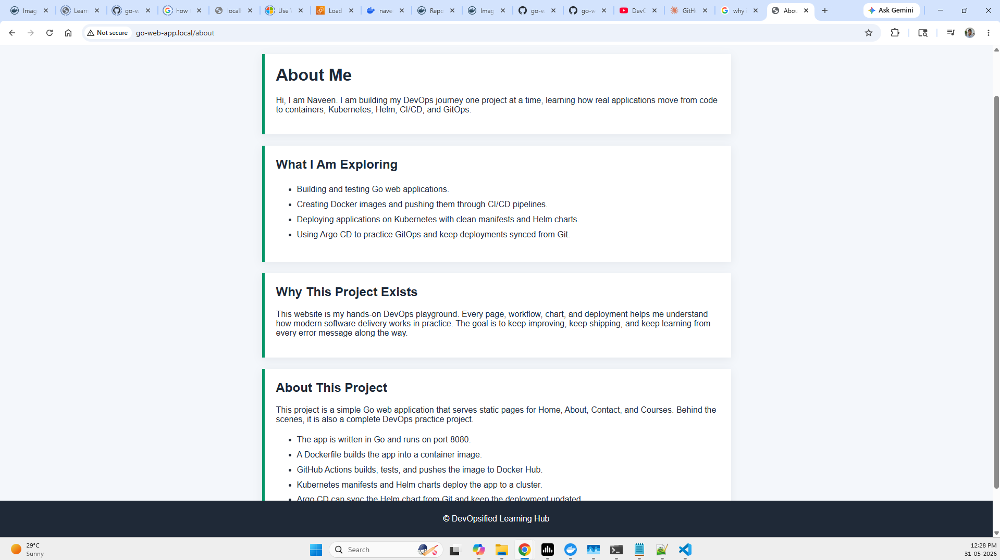

# Go Web App DevOps Project

This repository contains a simple Go web application and a complete DevOps practice setup around it. The app serves static HTML pages for Home, About, Contact, and Courses, while the project demonstrates how to build, containerize, deploy, and continuously update an application.

## Project Overview

- Go web server using the `net/http` package
- Static pages served from the `static/` directory
- Docker multi-stage build using Go 1.23 and a distroless runtime image
- GitHub Actions workflow for build, test, lint, Docker image push, and Helm chart tag updates
- Kubernetes manifests for direct deployment
- Helm chart for reusable Kubernetes deployment
- Argo CD compatible GitOps deployment from the Helm chart

## Prerequisites

Install these tools before running the full project:

- Git
- Go 1.23 or newer
- Docker
- AWS CLI, if you deploy to Amazon EKS
- kubectl
- Helm
- Argo CD CLI, if you want to manage Argo CD from the terminal
- A Kubernetes cluster such as Minikube, Kind, Docker Desktop Kubernetes, EKS, AKS, or GKE
- Argo CD, if you want GitOps deployment

Check your versions:

```bash
git --version
go version
docker --version
aws --version
kubectl version --client
helm version
argocd version --client
```

## Installation

Clone the repository:

```bash
git clone https://github.com/VenkataNaveenReddyYaparla/go-web-app.git
cd go-web-app
```

Download Go modules:

```bash
go mod download
```

Verify module dependencies:

```bash
go mod verify
```

Run tests:

```bash
go test ./...
```

Verify the test run:

```bash
go test -v ./...
```

Start the application locally:

```bash
go run main.go
```

Open the app:

```text
http://localhost:8080/home
```

Verify the app responds:

```bash
curl http://localhost:8080/home
```

## Application Routes

```text
/home
/about
/contact
/courses
```

The application runs on port `8080`.

## Repository Structure

```text
.
|-- .github/workflows/ci.yaml
|-- Dockerfile
|-- go.mod
|-- main.go
|-- main_test.go
|-- static/
|   |-- home.html
|   |-- about.html
|   |-- contact.html
|   `-- courses.html
|-- k8s/manisfests/
|   |-- deployment.yaml
|   |-- service.yaml
|   `-- ingress.yaml
`-- helm/go-web-app-charts/
    |-- Chart.yaml
    |-- values.yaml
    `-- templates/
```

## Run Locally

```bash
go run main.go
```

Open the app:

```text
http://localhost:8080/home
```

Run tests:

```bash
go test ./...
```

## Build And Run Locally

Build the application binary:

```powershell
go build -o main.exe .
```

Verify the binary was created:

```powershell
Get-ChildItem .\main.exe
```

Run the application:

```powershell
.\main.exe
```

Open the app:

```text
http://localhost:8080/home
```

Verify the running app from another terminal:

```powershell
Invoke-WebRequest http://localhost:8080/home
```

## Build With Docker

Build the image:

```bash
docker build -t go-web-app:local .
```

Verify the image:

```bash
docker images go-web-app
```

Run the container:

```bash
docker run -p 8080:8080 go-web-app:local
```

Open the app:

```text
http://localhost:8080/home
```

Verify the container is running:

```bash
docker ps
curl http://localhost:8080/home
```

## Connect To Amazon EKS

Verify AWS CLI authentication:

```bash
aws sts get-caller-identity
```

Update your local kubeconfig for the EKS cluster:

```bash
aws eks update-kubeconfig --region us-east-1 --name demo-cluster
```

Verify the Kubernetes context:

```bash
kubectl config current-context
kubectl get nodes
```

## Install NGINX Ingress Controller On EKS

Install the AWS provider manifest for ingress-nginx:

```bash
kubectl apply -f https://raw.githubusercontent.com/kubernetes/ingress-nginx/controller-v1.11.1/deploy/static/provider/aws/deploy.yaml
```

Verify the controller pods and service:

```bash
kubectl get pods -n ingress-nginx
kubectl get svc -n ingress-nginx
```

Wait for the external load balancer address:

```bash
kubectl get svc ingress-nginx-controller -n ingress-nginx
```

## Deploy With Kubernetes Manifests

Apply the manifests:

```bash
kubectl apply -f k8s/manisfests/
```

Check the resources:

```bash
kubectl get pods
kubectl get svc
kubectl get ingress
```

Verify the application pods are ready:

```bash
kubectl rollout status deployment/go-web-app
kubectl get endpoints
```

Remove the deployment:

```bash
kubectl delete -f k8s/manisfests/
```

## Deploy With Helm

Install the chart:

```bash
helm install go-web-app helm/go-web-app-charts
```

Check the release:

```bash
helm list
kubectl get pods
kubectl get svc
```

Verify the Helm deployment:

```bash
helm status go-web-app
kubectl rollout status deployment/go-web-app
```

Upgrade after changes:

```bash
helm upgrade go-web-app helm/go-web-app-charts
```

Uninstall:

```bash
helm uninstall go-web-app
```

## Install Argo CD

Create the Argo CD namespace:

```bash
kubectl create namespace argocd
```

Verify the namespace:

```bash
kubectl get namespace argocd
```

Install Argo CD:

```bash
kubectl apply -n argocd -f https://raw.githubusercontent.com/argoproj/argo-cd/stable/manifests/install.yaml
```

Verify the Argo CD pods:

```bash
kubectl get pods -n argocd
kubectl wait --for=condition=available deployment/argocd-server -n argocd --timeout=300s
```

Expose the Argo CD server with a LoadBalancer service:

```bash
kubectl patch svc argocd-server -n argocd -p '{"spec": {"type": "LoadBalancer"}}'
```

Verify the service and wait for the external address:

```bash
kubectl get svc argocd-server -n argocd
```

Verify the Argo CD CLI:

```bash
argocd version --client
```

Get the initial admin password:

```bash
kubectl get secret argocd-initial-admin-secret -n argocd -o jsonpath="{.data.password}"
```

Decode the password:

```bash
kubectl get secret argocd-initial-admin-secret -n argocd -o jsonpath="{.data.password}" | base64 -d
```

PowerShell decode:

```powershell
$password = kubectl get secret argocd-initial-admin-secret -n argocd -o jsonpath="{.data.password}"
[System.Text.Encoding]::UTF8.GetString([System.Convert]::FromBase64String($password))
```

## Deploy With Argo CD

Use this repository as the Git source and point Argo CD to the Helm chart path:

```text
Repository URL: https://github.com/VenkataNaveenReddyYaparla/go-web-app.git
Revision: main
Path: helm/go-web-app-charts
Namespace: default
```

Example Argo CD Application manifest:

```yaml
apiVersion: argoproj.io/v1alpha1
kind: Application
metadata:
  name: go-web-app
  namespace: argocd
spec:
  project: default
  source:
    repoURL: https://github.com/VenkataNaveenReddyYaparla/go-web-app.git
    targetRevision: main
    path: helm/go-web-app-charts
    helm: {}
  destination:
    server: https://kubernetes.default.svc
    namespace: default
  syncPolicy:
    automated:
      prune: true
      selfHeal: true
```

Apply it:

```bash
kubectl apply -f application.yaml
```

Verify Argo CD created and synced the application:

```bash
kubectl get application go-web-app -n argocd
kubectl get pods
kubectl get svc
```

Argo CD can sync the Helm chart and keep the Kubernetes deployment updated from Git.

## CI/CD Workflow

The GitHub Actions workflow:

1. Builds the Go application.
2. Runs tests.
3. Runs `golangci-lint`.
4. Builds and pushes a Docker image to Docker Hub.
5. Updates the Helm chart image tag with the GitHub Actions run ID.

Required GitHub secrets:

```text
DOCKERHUB_USERNAME
DOCKERHUB_TOKEN
TOKEN
```

## Screenshot


